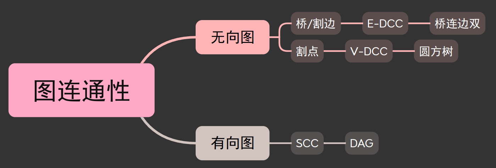
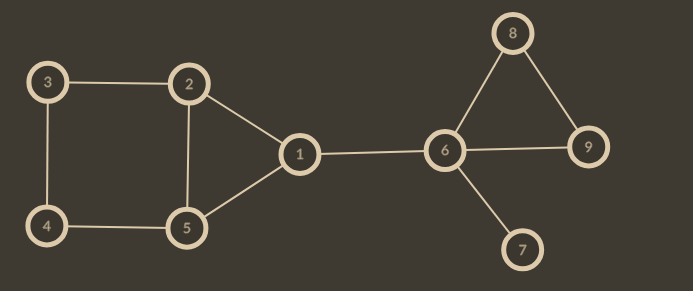
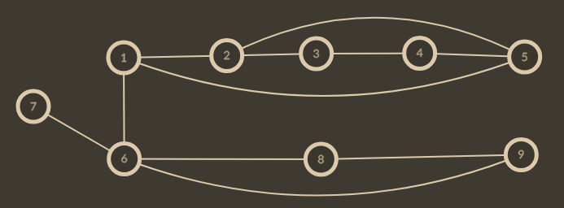
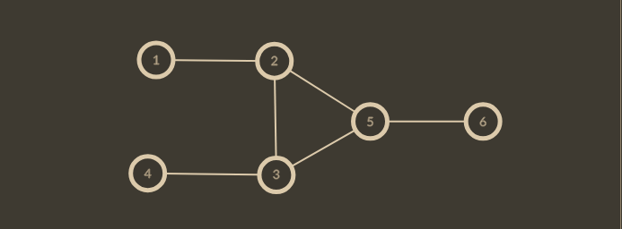

# 图论/连通性 - FriNov22 2024


## 搜索
- 搜索树
- 前向边、返租边、横向边（有向图）
- 时间戳 $r(u)$
- 追溯值 $s(u)$
- 子树 $T(u)$
- 孩子 $c(u) = \{v|(u,v)\in T(u)\}$
- 连通栈

本文中用节点的时间戳代替编号。这个函数的意思是更新最小值：
```cpp
template<typename T>
void din(T &x, T a) { if (x > a) x = a; }
```

## 无向
假设有一个图：



它的搜索树是这个（假设节点编号与时间戳相等）



### 边
> E-DCC（Edge - Double Connected Component）

每个边双都不相交，缩成树就是桥连边双。
```txt
(12345) ---- (689) ---- (7)
```

$(u,v)$ 是桥，仅当 $(u,v)\in E$ 且 $r(u)<s(v)$. 这时有 $r(v)=s(v)$，$v$ 到连通栈顶所有点都是边双。

求点双时重边没影响，但是边双有影响了。但是无向图存图时都把一条无向边存成 2 条有向边了，所以遇到返租边时要看看时不是原本树边的反向边。
```cpp
// E-DCC P8436
void tar(int u, int q) {
  static int tm = 0;
  ti[u] = lo[u] = ++tm;
  it[u] = true, st[top++] = u;

  for (int p=hd[u], v; ~p; p=nx[p])
    if (!ti[v = to[p]]) {
      g(v, p), din(lo[u], lo[v]);
      if (ti[u] < lo[v]); // (u, v) 是桥
    } else if (p ^ q ^ 1)
      din(lo[u], ti[v]);

  if (ti[u] == lo[u]) {
    while (true) {
      int v = st[--top];
      dcc[u].emplace_back(v);
      if (v==u) break;
    }
    cnt++;
  }
}
```

### 点
> V-DCC（Vertex - Double Connected Component）

每 2 个点双最多同时包含一个割点，但一个割点可以同时存在多个点双里，一个点双可能同时包含 3 个以上的割点。可以用圆方树维护：
- 非叶子圆点：割点；
- 非叶子方点：点双；
- 叶子：割点以外的点；
- 边：点和点双的“属于”关系。

当然，有时候圆方树的叶子不重要。
```
                             [67]
                              |
[12345] --- (1) --- [16] --- (6)
                              |
                             [69]
```

一个点双（235）有三个割点，一个割点（5）存在于 3 个点双的例子：



非根节点是割点，仅当 $\exist v\in c(u),\ r(v)\le s(u)$. 这意味着，删去 $u$ 后 $v$ 会从图中独立出来。

根节点是割点，仅当 $|c(u)|\ge2$.
```cpp
// V-DCC P8435
// 割点 P3388
void tar(int u, int pa) {
  static int tm = 0;
  lo[u] = ti[u] = ++tm;
  if (u == pa && !hd[u]) {
    ans[cnt++].push_back(u);
    return;
  }

  st[top++] = u;
  for (int p=hd[u]; p; p=nx[p])
    if (!ti[to[p]]) {
      tar(to[p], u), din(lo[u], lo[to[p]]);
      if (lo[to[p]] >= ti[u]) {
        int t; do {
          t = st[--top];
          ans[cnt].push_back(t);
        } while (t != to[p]);
        ans[cnt++].push_back(u);
      }
    } else din(lo[u], ti[to[p]]);
}
```

## 有向
> E-SCC（Strongly Connected Component）

u 是它所在的 SCC 中时间戳最小的点，仅当 $r(u)=s(u)$
```cpp
// SCC P3387
void tar(int u) {
  /* ti: dfs 时结点 [u] 被搜索的次序
   * lo: 从 u 子树里走一条非树边能到达的边里
   *     ti 的最小值
   * st,top,it: SCC 栈
   * be: 每个点属于的 scc 里 ti 最小的点
   * 性质:
   *   从根开始的一条路径上, ti 严格递增，lo 非降
   *   一个结点的子树内结点的 ti 都大于该结点的 ti
   */
  ti[u]=lo[u]=++tm;
  st[top++]=u, it[u]=true;
  for (int p=hd[u], v; ~p; p=nx[p]) {
    if (!ti[v=to[p]]) {
      tar(v);
      din(lo[u], lo[v]);
    } else if (it[v])
      din(lo[u], ti[v]);
  }
  if (ti[u]==lo[u]) while (true) {
    int v=st[--top];
    it[v]=false;
    be[v]=u;
    if (v==u) break;
  }
}
```
