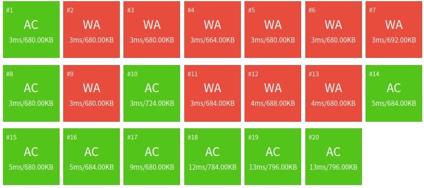

# [NOIP2017 普及组] 棋盘 - WedJul19 2023
[提交记录](https://www.luogu.com.cn/record/list?pid=P3956&user=477758) [题目传送门](https://www.luogu.com.cn/problem/P3956)
主要讲讲从 5 分到 100 分的变化。
| 时间           | 状态       | 分数 |
| -------------- | ---------- | ---- |
| 07-19 14:37:47 | Accepted   | 100  |
| 07-19 14:36:45 | Unaccepted | 25   |
| 07-19 14:31:18 | Unaccepted | 55   |
| 07-18 19:48:59 | Accepted   | 100  |
| 07-18 16:46:50 | Unaccepted | 50   |
| 07-18 16:44:54 | Unaccepted | 50   |
| 07-18 14:56:24 | Unaccepted | 50   |
| 07-18 14:50:11 | Unaccepted | 50   |
| 07-18 14:43:57 | Unaccepted | 15   |
| 07-18 14:42:40 | Unaccepted | 15   |
| 07-18 14:32:01 | Unaccepted | 15   |
| 07-18 14:30:21 | Unaccepted | 5    |
| 07-18 14:25:37 | Unaccepted | 5    |

## 题意
有一个 $m \times m$ 的棋盘，棋盘上有 $n$ 个格子有颜色（红/黄），其它格子没颜色。

任何一个时刻，所站在位置必须有颜色（不能无色），只能向上、 下、左、 右四个方向前进。从一个格子走向另一个格子时，如果两个格子的颜色相同，那花费为 $0$；如果不同，则花费为 $1$。让一个无色格子暂时变为某个颜色花费为 2，这个操作不能连续使用，而且走过变色格子后格子的颜色会变回无色。求从左上角 `(0, 0)` 到右下角 `(m-1, m-1)` 最小花费。保证左上角有颜色。

## 代码实现
一种思路是，把棋盘转化为一个图，求一遍最短路。其中图的节点是有色格子。

### 1.cpp
```cpp
#include <iostream>
#include <queue>
#define add(u, v, w) (eg[tot] = {v, hd[u], w}, hd[u] = tot++)
const int M = 102, N = 1003, dx[]{-1, 1, 0, 0}, dy[]{0, 0, -1, 1};
int m, n, mp[M][M], ans = -1, hd[N], tot;
struct edge { int to, nx, wg; } eg[N * 8];

using pii = std::pair<int, int>;
std::priority_queue<pii, std::vector<pii>, std::greater<pii>> pq;  // [dis_u, u]
int dis[N]; bool used[N];
int main() {
  std::cin >> m >> n;
  while (n--) {
    int x, y, c;
    std::cin >> x >> y >> c;
    mp[x - 1][y - 1] = c + 1;
  }
  for (int i = 0; i < m * m; i++) hd[i] = -1;
  for (int i = 0; i < m; i++) for (int j = 0; j < m; j++) if (mp[i][j]) {
    for (int k = 0; k < 4; k++) {
      int ii = i + dx[k], jj = j + dy[k];
      if (0 > ii || ii >= m || 0 > jj || jj >= m) continue;
      if (mp[ii][jj]) add(i * m + j, ii * m + jj, mp[i][j] != mp[ii][jj]);
      else for (int kk = 0, i3, j3; kk < 4; kk++) if (kk ^ k ^ 1) {
        i3 = ii + dx[kk], j3 = jj + dy[kk];
        if (mp[i3][j3]) add(i * m + j, i3 * m + j3, 2 + (mp[i][j] != mp[i3][j3]));
      }
    }
  }
  for (int i = 0; i < m * m; i++) dis[i] = 0x7fffffff, pq.push({dis[i], i});
  dis[0] = 0;
  while (!pq.empty()) {
    int u = pq.top().second; pq.pop();
    if (used[u]) continue;
    for (int p = hd[u]; ~p; p = eg[p].nx) {
      int t = dis[u] + eg[p].wg;
      if (t < dis[eg[p].to]) dis[eg[p].to] = t;
    }
  }
  std::cout << (dis[m * m - 1] == 0x7fffffff ? -1 : dis[m * m - 1]) << '\n';
}
```
11WA，1TLE，7RE，5 分。

### 2.cpp
```cpp
for (int i = 0; i < m * m; i++) dis[i] = 0x7fffffff, pq.push({dis[i], i});
dis[0] = 0;
while (!pq.empty()) {
  int u = pq.top().second; pq.pop();
  if (used[u]) continue;
  for (int p = hd[u]; ~p; p = eg[p].nx) {
    int t = dis[u] + eg[p].wg;
    if (t < dis[eg[p].to]) dis[eg[p].to] = t;
  }
}
```
注意这段 Dijkstra，少了标记 used[u]，所以我加上 `used[u]=true` 后提交了。
```cpp
  if (used[u]) continue;
+ used[u] = true;
  for (int p = hd[u]; ~p; p = eg[p].nx) {
```
成绩没变。

### 3.cpp
松弛操作里，没有更新最短边队列。我加上更新后又交了。
```cpp
if (t < dis[eg[p].to]) dis[eg[p].to] = t, pq.push({t, eg[p].to});
                                        ++++++++++++++++++++++++
```
10WA(-1), 17RE，0TLE(-1)，15(+10) 分。

### 4.cpp
```cpp
for (int i = 0; i < m * m; i++) dis[i] = 0x7fffffff, pq.push({dis[i], i});
dis[0] = 0;
```
这是 Dijkstra 的初始化代码。`dis` 初始化没问题，但是队列初始化后都是 inf, 而不是 `{(0, 0), (inf, 1), ..., (inf, n-1)}`，这不是我想要的。事实上，初始化时队列并不需要添加距离为无限大的点，因为即使把距离为无限大的点拿出来，也不能给其它点松弛。我修改了初始化，又提交了。
```cpp
for (int i = 1; i < m * m; i++) dis[i] = 0x7fffffff, pq.push({dis[i], i});
             ~
dis[0] = 0, pq.push({0, 0});
          +++++++++++++++++
```
成绩一样。

### 5.cpp
这是存点相关数组的代码。
```cpp
const int M = 102, N = 1003;
int dis[N]; bool used[N];
```
按照我建图的方法，似乎只有 $n$ 个点。但是，代码实现时，我把位于 `(i, j)` 的格子映射为编号为 `i*m+j` 的点。这意味着，点的编号最大为 $m^2$，所以我数组开小了。这个图并不是只有 $n$ 个点，而是有 $m^2$ 个点，其中的 $n$ 个点可能有出边。
```cpp
int dis[M*M]; bool used[M*M];
        ~~~             ~~~
```
10WA，2RE(-15)，3TLE(+3)，15 分。

### 6.cpp
这次改了两处！
```cpp
int m, n, mp[M][M], hd[N], tot;
```
和上一个一样的漏洞，链式前向星的 `hd` 数组没有修改。
```cpp
int m, n, mp[M][M], hd[M * M], tot;
                       ~~~~~
```

```cpp
else for (int kk = 0, i3, j3; kk < 4; kk++) if (kk ^ k ^ 1) {
  i3 = ii + dx[kk], j3 = jj + dy[kk];
  if (mp[i3][j3]) add(i * m + j, i3 * m + j3, 2 + (mp[i][j] != mp[i3][j3]));
}
```
建图的操作是，从有色格子遍历 4 个方向（`k`），如果到达有色格子就建边；如果到了无色格子就再往四个方向（`kk`）再走一步，如果方向不相反（`kk^k^1`）就尝试建边。漏洞在于没有越界判断。
```cpp
else for (int kk = 0, i3, j3; kk < 4; kk++) if (kk ^ k ^ 1) {
  i3 = ii + dx[kk], j3 = jj + dy[kk];
  if (0 > i3 || i3 >= m || 0 > j3 || j3 >= m || !mp[i3][j3]) continue;
      +++++++++++++++++++++++++++++++++++++++++++            +++++++++
  add(i * m + j, i3 * m + j3, 2 + (mp[i][j] != mp[i3][j3]));
}
```
10WA，0RE(-2)，0TLE(-3)，50 分，“错了一火车”。


### 7.cpp
又回到松弛代码。
```cpp
for (int p = hd[u]; ~p; p = eg[p].nx) {
  int t = dis[u] + eg[p].wg;
  if (t < dis[eg[p].to]) dis[eg[p].to] = t, pq.push({t, eg[p].to});
}
```
如果 `dis[u]` 是无限大怎么办？如果继续的硬算的话就会溢出（即使取的 `inf` 不会立即溢出，经过足够多次累加后仍会溢出）。一种解决方法是，遇到 `dis[u]` 为无限大时退出算法（因为此时队列里剩余的全是无限大，无限大都不能松弛）；另一种方法是初始化时不让无限大进队。
```cpp
  for (int p = hd[u]; ~p; p = eg[p].nx) {
    int t = dis[u] + eg[p].wg;
+   if (dis[u] == 0x7fffffff) t = 0x7fffffff;
    if (t < dis[eg[p].to]) dis[eg[p].to] = t, pq.push({t, eg[p].to});
  }
```
成绩一样。

### 8.cpp
把代码重新写了一遍，没发现其它的漏洞。
```cpp
#include <cstdio>
#include <queue>
const int M = 102, N = 1003, INF = 0x7fffffff;
int m, n, mp[M][M];

struct edge { int to, nx, wg; } eg[N * 8];
int hd[M * M], tot;
#define add(u, v, w) (eg[tot] = {v, hd[u], w}, hd[u] = tot++)

using pii = std::pair<int, int>;
std::priority_queue<pii, std::vector<pii>, std::greater<pii>> pq;
int dis[M * M]; bool used[M * M];

void read() {
  int r, c, col;
  scanf("%d%d", &m, &n);
  while (n--) {
    scanf("%d%d%d", &r, &c, &col);
    mp[r - 1][c - 1] = col + 1;
  }
}

void build() {
  for (int i = 0; i < m * m; i++) hd[i] = -1;
  const int dr[]{-1, 1, 0, 0}, dc[]{0, 0, -1, 1};
  int rr, cc, r3, c3;
  for (int r = 0; r < m; r++) for (int c = 0; c < m; c++)
    if (mp[r][c]) for (int i = 0; i < 4; i++) {
      rr = r + dr[i], cc = c + dc[i];
      if (0 > rr || rr >= m || 0 > cc || cc >= m) continue;
      if (mp[rr][cc]) add(r * m + c, rr * m + cc, mp[r][c] != mp[rr][cc]);
      else for (int j = 0; j < 4; j++) if (i ^ j ^ 1) {
        r3 = rr + dr[j], c3 = cc + dc[j];
        if (0 > r3 || r3 >= m || 0 > c3 || c3 >= m || !mp[r3][c3]) continue;
        add(r * m + c, r3 * m + c3, 2 + (mp[r][c] != mp[r3][c3]));
      }
    }
}
void dijk() {
  dis[0] = 0, pq.push({0, 0});
  for (int i = 1; i < m * m; i++) dis[i] = INF, pq.push({INF, i});
  while (!pq.empty()) {
    int u = pq.top().second; pq.pop();
    if (used[u]) continue;
    used[u] = true;
    if (dis[u] != INF) for (int p = hd[u]; ~p; p = eg[p].nx) {
      int d = dis[u] + eg[p].wg;
      if (dis[eg[p].to] > d) dis[eg[p].to] = d, pq.push({d, eg[p].to});
    }
  }
}
int main() {
  read(), build(), dijk();
  printf("%d\n", dis[m * m - 1] == INF ? -1 : dis[m * m - 1]);
}
```
成绩一样。

### 9.cpp
```cpp
if (dis[eg[p].to] > d) dis[eg[p].to] = d, pq.push({d, eg[p].to});
```
加了没用的一条语句，成绩一样。也就是入队前判断是否未使用过。事实是，已经使用（标记）过的点已经找到了最短路，不会再更新了。
```cpp
if (dis[eg[p].to] > d) {
  dis[eg[p].to] = d;
  if (!used[eg[p].to]) pq.push({d, eg[p].to});
  ++++++++++++++++++++
}
```

### 10.cpp
对着 DFS 题解抄了一遍，AC 了。这次提交不计入成绩差分。
```cpp
#include <cstdio>
const int N = 102, inf = 0x7fffffff, dx[]{-1, 1, 0, 0}, dy[]{0, 0, -1, 1};
int n, a[N][N], dis[N][N], ans = inf;
bool vis[N][N];
void read() {
  int m, x, y, c;
  scanf("%d%d", &n, &m);
  while (m--) {
    scanf("%d%d%d", &x, &y, &c);
    a[x - 1][y - 1] = c + 1;
  }
}
void dfs(int x, int y, int ost, int lur) {
  if (x + 1 == n && y + 1 == n) {
    if (ost < ans) ans = ost;
    return;
  }
  for (int i = 0; i < 4; i++) {
    int xx = x + dx[i], yy = y + dy[i];
    if (0 > xx || xx >= n || 0 > yy || yy >= n || vis[xx][yy]
      || !a[x][y] && !a[xx][yy]) continue;
    if (a[xx][yy]) {
      if (lur == a[xx][yy] && ost < dis[xx][yy]) {
        vis[xx][yy] = true, dis[xx][yy] = ost;
        dfs(xx, yy, ost, lur);
        vis[xx][yy] = false;
      } else if (ost + 1 < ans && ost + 1 < dis[xx][yy]) {
        vis[xx][yy] = true, dis[xx][yy] = ost + 1;
        dfs(xx, yy, ost + 1, a[xx][yy]);
        vis[xx][yy] = false;
      }
    }
    else if (ost + 2 < dis[xx][yy]) {
      vis[xx][yy] = true, dis[xx][yy] = ost + 2;
      dfs(xx, yy, ost + 2, lur);
      vis[xx][yy] = false;
    }
  }
}
int main() {
  read();
  for (int i = 0; i < n; i++) for (int j = 0; j < n; j++) dis[i][j] = inf;
  vis[0][0] = true; dfs(0, 0, 0, a[0][0]);
  printf("%d\n", ans == inf ? -1 : ans);
}
```

### 11.cpp
7 月 19 日中午，我下载一个数据点，发现了漏洞。之前我们建的边两端都必须有颜色嘛，但题目保证起点有颜色，但不保证终点有颜色。如果终点没颜色，那么我的代码就搜索不到路径。实际上，走到终点后搜索就能结束了，不用管别的什么。所以建图时特判是否到达终点即可。但我脑子抽风了，把特判放在走两步（而不是走一步后）。
```cpp
if (0 > r3 || r3 >= m || 0 > c3 || c3 >= m || !mp[r3][c3]) continue;
```
```cpp
  if (0 > r3 || r3 >= m || 0 > c3 || c3 >= m) continue;
  if (!mp[r3][c3]) {
+   if (r3 + 1 == m && c3 + 1 == m) add(r * m + c, m * m - 1, 2);
+   else continue;
  }
```
9WA(-1)，55 分。

### 12.cpp
我提交后发现特判塞错了，所以我改过来又交了一次。
```cpp
else for (int j = 0; j < 4; j++) if (i ^ j ^ 1) {
  r3 = rr + dr[j], c3 = cc + dc[j];
  if (0 > r3 || r3 >= m || 0 > c3 || c3 >= m) continue;
- if (!mp[r3][c3]) {
-   if (r3 + 1 == m && c3 + 1 == m) add(r * m + c, m * m - 1, 2);
-   else continue;
- }
  add(r * m + c, r3 * m + c3, 2 + (mp[r][c] != mp[r3][c3]));
}
```
```cpp
+ else if (rr + 1 == m || cc + 1 == m) add(r * m + c, m * m - 1, 2);
  else for (int j = 0; j < 4; j++) if (i ^ j ^ 1) {
    r3 = rr + dr[j], c3 = cc + dc[j];
    if (0 > r3 || r3 >= m || 0 > c3 || c3 >= m || !mp[r3][c3]) continue;
    add(r * m + c, r3 * m + c3, 2 + (mp[r][c] != mp[r3][c3]));
  }
```
15WA(+6)，25 分。

### 13.cpp
```cpp
else if (rr + 1 == m || cc + 1 == m) add(r * m + c, m * m - 1, 2);
```
但我还是写错了。改过来提交，终于 AC 了。
```cpp
else if (rr + 1 == m && cc + 1 == m) add(r * m + c, m * m - 1, 2);
                     ~~
```

## 总结
这道题目综合了我的常见错误，包含了模板、越界判断、数组、算法设计。

### 模板和越界判断
我在这里总结我自己的 Dijkstra 模板：
```cpp
const int N = ..., M = ..., inf = 0x7fffffff;
using pii = std::pair<int, int>;
std::priority_queue<pii, std::vector<pii>, std::greater<pii>> pq;
int hd[N], to[M], nx[M], wg[M], ds[N], s;
bool ok[N];

for (int i = 0; i < n; i++) ds[i] = inf, ok[i] = false;
ds[s] = 0; pq.push({0, s});
while (!pq.empty()) {
  int u = pq.top().second; pq.pop();
  if (ok[u]) continue;
  ok[u] = true;
  for (int p = hd[u]; ~p; p = nx[p]) {
    int v = to[p], k = ds[u] + wg[p];
    if (ds[v] > k) ds[v] = k, pq.push({k, v});
  }
}

```
搜索时一定不能忘记的越界判断：
```cpp
if (0 > rr || rr >= n || 0 > cc || cc >= m || vis[rr][cc]) continue;
```
### 数组大小
估计点数量时不能漏掉没有边的点。另外，写 Johnson 最短路时一定不能写错边数量是 $N+M$。

### 算法设计
开始时看到“保证左上角有颜色”时就应该联想到“不保证右下角有颜色”。用 DFS 没错的原因是，“踩着的格子原本有没有颜色”被编码进了参数 `lur`，从而保证数据能到达终点时，程序能搜到终点。
