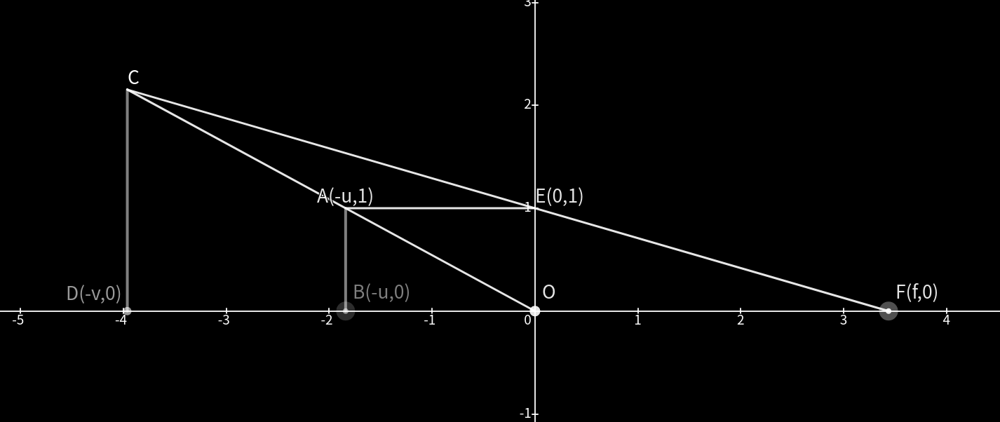
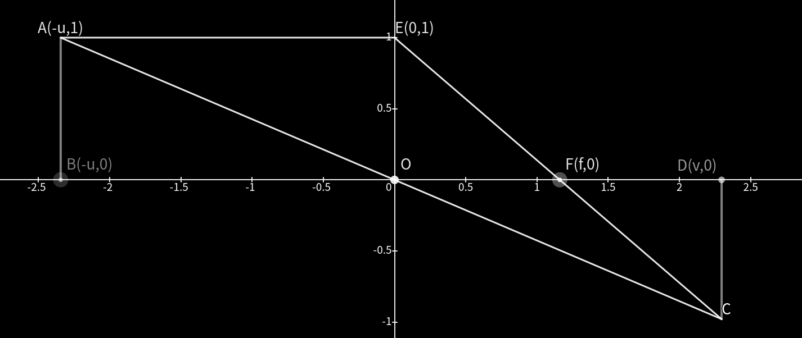

# 凸透镜成像 - WedOct26 2022
简单地在理论层面谈谈凸透镜成像中物距 $u$、像距 $v$ 和焦距 $f$ 的关系。下图中 $y$ 轴表示凸透镜，$AB$ 是蜡烛，$A$ 是光源，$C$ 是像，$F$ 是其中一个焦点。由于物体高度与物距、像距和焦距无关，所以这里直接令高度为 $1$ 个单位。

 

~~虚像应该画虚线的，但是我懒那就这样吧。~~

| 物距与焦距的关系  | $u$ $v$ $f$   | 像        |
| ----------------- | ------------- | --------- |
| $0<u<f$           | $1/u-1/v=1/f$ | 正立虚像  |
| $u=f$             |               | 不成像    |
| $f<u$             | $1/u+1/v=1/f$ | 倒立实像  |

| 物距与焦距关系  | 像的大小  |
| --------------- | --------- |
| $f<u<2f$        | 放大      |
| $u=2f$          | 等大      |
| $2f<u$          | 缩小      |

平面内两直线确定一个点。要想知道像的位置，只需要确定两条特殊光线就行了，这里选择与主光轴平行的光线 $AE$、过光心的光线 $AO$。经过光心的光线方向不变，与主光轴平行的光线经过折射后过 $F$。两光线最终交于 $C$。$C$ 就是像的位置。

## 代数推导
一次函数。写出直线 $AO$ 的解析式和 $EF$ 的解析式，然后求焦点即可。
$$y_{AO} = -\frac xu, y_{EF} = -\frac1f(x - f) = 1 - \frac xf$$

### 成实像
$$
\begin{aligned}
      -\frac vu&=1-\frac vf\\
       -\frac1u&=\frac1v-\frac1f\\
\frac1u+\frac1v&=\frac1f
\end{aligned}
$$

### 成虚像
把 $v$ 换成 $-v$ 即可（因为虚像成在左边）。
$$
\begin{aligned}
\frac1u+\frac1{-v}&=\frac1f\\
   \frac1u-\frac1v&=\frac1f
\end{aligned}
$$

## 几何推导
相似三角形。

### 成虚像
$$
\begin{gathered}
\triangle CAE \sim \triangle COF \Rightarrow \frac{AE}{OF}=\frac{CA}{CO}\\
\triangle ABO \sim \triangle CDO \Rightarrow \frac{BO}{DO}=\frac{AO}{CO}\\
\frac{AE}{OF}=\frac{CO-AO}{CO}=1-\frac{AO}{CO}=1-\frac{BO}{DO}\\
\frac uf=1-\frac uv \Rightarrow \frac1u-\frac1v=\frac1f
\end{gathered}
$$

### 成实像
$$
\begin{gathered}
\triangle AEC \sim \triangle OFC \Rightarrow \frac{AE}{OF}=\frac{AC}{CO}\\
\triangle ABO \sim \triangle CDO \Rightarrow \frac{BO}{DO}=\frac{AO}{CO}\\
\frac{AE}{OF}=\frac{AO+CO}{CO}=\frac{AO}{CO}+1=\frac{BO}{DO}+1\\
\frac uf=\frac uv+1 \Rightarrow \frac1u+\frac1v=\frac1f
\end{gathered}
$$

## 像和蜡烛的大小
没啥好说的，只需要简单的不等式知识即可。
